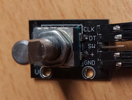

  

# Rotary encoder for Tiny Tapeout

The signals from the rotary encoder are sent to the ASIC which controls the seven-segment display.

The rotary pins are sampled every clock cycle. 
If a rising edge is detected on pin A, the 4 bit counter will be incremented/decremented depending on pin B.
The counter is put on the seven segment display and a debounce time is started (125 clk cycles)

## What is Tiny Tapeout?

TinyTapeout is an educational project that aims to make it easier and cheaper than ever to get your digital designs manufactured on a real chip!

Go to https://tinytapeout.com

## Resources

* [Wikipedia: Rotary encoders](https://en.wikipedia.org/wiki/Rotary_encoder)
* [Tiny Tapeout FAQ](https://tinytapeout.com/faq/)
* [Digital design lessons](https://tinytapeout.com/digital_design/)
* [Join the community](https://discord.gg/rPK2nSjxy8)
